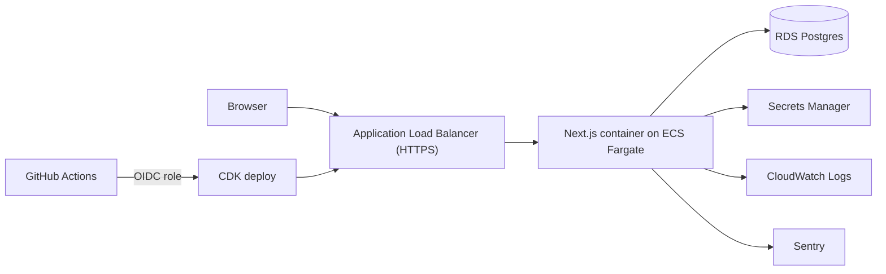

# Architecture

## Overview

## Application layers

| Layer | Location | Notes |
| --- | --- | --- |
| Scenario content | `src/scenarios/` | Typed data validated by a Zod schema. Changes go through PR review. |
| Scenario engine | `src/game/engine/` | Pure TypeScript. No DOM, no Phaser. Fully unit tested. |
| Renderer | `src/game/phaser/` | Phaser 4 scene that draws the pitch and plays engine-provided moves. Loaded client-side only. |
| UI | `src/app/`, `src/components/` | Next.js App Router. Prompt and choices are HTML (accessible), the pitch is a canvas. |
| Auth | `src/lib/auth/` | iron-session encrypted cookie; nickname + scrypt password hash. |
| Data access | `src/lib/db.ts`, `src/lib/progress.ts` | Prisma 7 with the `pg` driver adapter. Only server code imports these. |
| Observability | `src/lib/logger.ts`, `instrumentation*.ts` | Pino JSON logs to stdout (CloudWatch), Sentry when a DSN is set. |

## Data model

- `User`: `id`, `nickname` (unique), `passwordHash`, `createdAt`.
- `Attempt`: `id`, `userId`, `scenarioSlug`, `choiceId`, `correct`, `createdAt`.

Scenario content is not stored in the database. Attempts reference scenarios by slug.

## Request flow for a scenario

1. `/play/[slug]` renders the prompt and choices on the server from scenario data.
2. The client mounts Phaser and draws the initial positions.
3. On answer, the engine returns the outcome and moves; Phaser animates them; the UI shows feedback.
4. Guests: the attempt is saved to `localStorage`. Signed-in users: a Server Action records it.

## Environments

| Env | Trigger | Notes |
| --- | --- | --- |
| local | `pnpm dev` | Postgres via `docker compose` |
| staging | every merge to `main` | smaller, no NAT gateway, tasks in public subnets |
| prod | manual approval in GitHub | private subnets, deletion protection, longer backup retention |

See `docs/adr/` for the reasons behind these choices.
