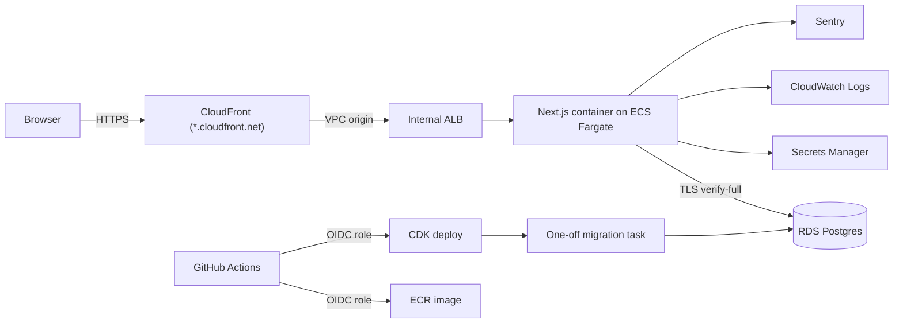

# Architecture

## Overview

## Infrastructure (`infra/`)

| Stack                     | Contents                                                              | Changes when                  |
| ------------------------- | --------------------------------------------------------------------- | ----------------------------- |
| `HockeyIq-Shared-Core`    | ECR repository, GitHub OIDC provider and deploy roles, monthly budget | rarely, deployed by hand      |
| `HockeyIq-<Env>-Platform` | VPC, RDS Postgres, Secrets Manager secrets, ECS cluster               | infrastructure changes        |
| `HockeyIq-<Env>-Migrate`  | Fargate task definition that runs `prisma migrate deploy`             | every release (new image tag) |
| `HockeyIq-<Env>-App`      | Fargate service, internal ALB, CloudFront distribution                | every release (new image tag) |

## Monitoring

- **Logs**: pino JSON to stdout, shipped to CloudWatch Logs `/hockey-iq/<env>/app`. Unhandled request errors are logged by `onRequestError` in `src/instrumentation.ts`.
- **Errors**: Sentry, server and browser, with no personal data (ADR 0007). Off when no DSN is set.
- **Alarms** (email via the `hockey-iq-<env>-alarms` SNS topic, on alarm and on recovery): ALB 5xx count, p95 latency, unhealthy tasks, task CPU and memory, CloudFront 5xx rate, error-level log lines, database CPU and free storage, and a Route 53 HTTPS uptime check on `/api/health`.
- **Cost**: AWS Budgets alerts at 80% and 100% of $100/month.

What to do when an alarm fires: `docs/runbooks/incident-response.md`.

Release flow and rollback: `docs/runbooks/deploy-and-rollback.md`. First-time setup: `docs/setup/aws-account.md`.

## Application layers

| Layer            | Location                                   | Notes                                                                                         |
| ---------------- | ------------------------------------------ | --------------------------------------------------------------------------------------------- |
| Scenario content | `src/scenarios/`                           | Typed data validated by a Zod schema. Changes go through PR review.                           |
| Scenario engine  | `src/game/engine/`                         | Pure TypeScript. No DOM, no Phaser. Fully unit tested.                                        |
| Renderer         | `src/game/phaser/`                         | Phaser 4 scene that draws the pitch and plays engine-provided moves. Loaded client-side only. |
| UI               | `src/app/`, `src/components/`              | Next.js App Router. Prompt and choices are HTML (accessible), the pitch is a canvas.          |
| Auth             | `src/lib/auth/`                            | iron-session encrypted cookie; nickname + scrypt password hash.                               |
| Data access      | `src/lib/db.ts`, `src/lib/progress.ts`     | Prisma 7 with the `pg` driver adapter. Only server code imports these.                        |
| Observability    | `src/lib/logger.ts`, `instrumentation*.ts` | Pino JSON logs to stdout (CloudWatch), Sentry when a DSN is set.                              |

## Data model

- `User`: `id`, `nickname` (unique), `passwordHash`, `createdAt`.
- `Attempt`: `id`, `userId`, `scenarioSlug`, `choiceId`, `correct`, `createdAt`.

Scenario content is not stored in the database. Attempts reference scenarios by slug.

## Request flow for a scenario

1. `/play/[slug]` renders the prompt and choices on the server from scenario data.
2. The client mounts Phaser and draws the initial positions.
3. On answer, the engine returns the outcome and moves; Phaser animates them; the UI shows feedback.
4. Guests: the attempt is saved to `localStorage`. Signed-in users: a Server Action records it.

## Environments

| Env     | Trigger                   | Notes                                                                        |
| ------- | ------------------------- | ---------------------------------------------------------------------------- |
| local   | `pnpm dev`                | Postgres via `docker compose`                                                |
| staging | every merge to `main`     | 1 small task in public subnets (no NAT gateway), single-AZ DB, 7-day backups |
| prod    | manual approval in GitHub | 2 tasks in private subnets, Multi-AZ DB, deletion protection, 14-day backups |

See `docs/adr/` for the reasons behind these choices.
